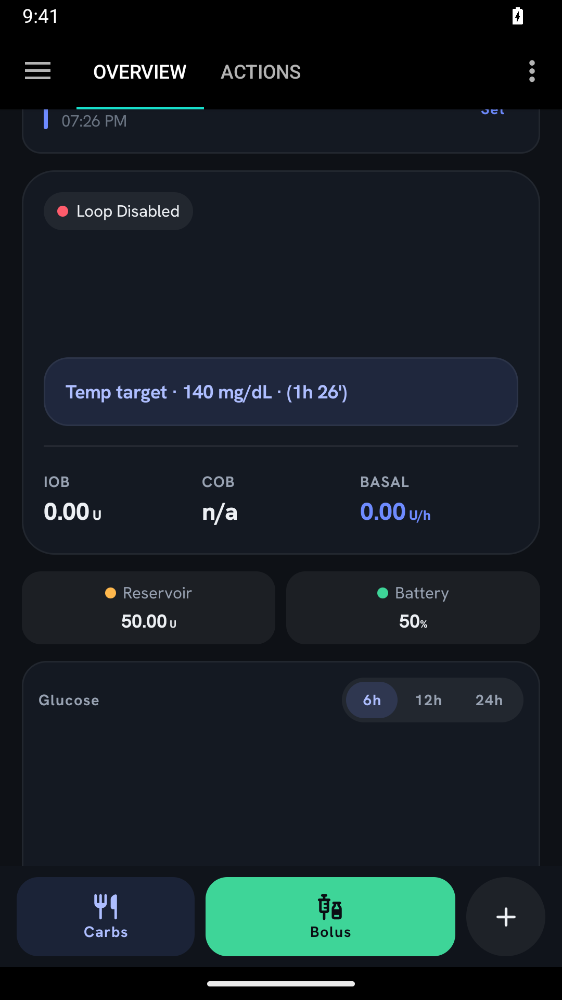
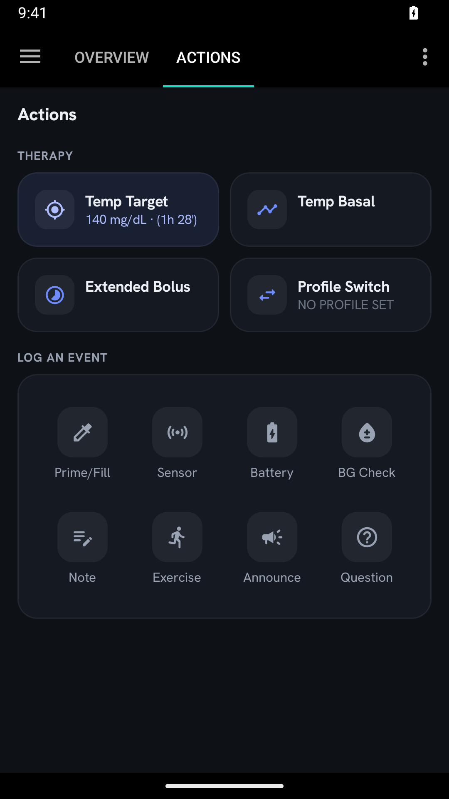
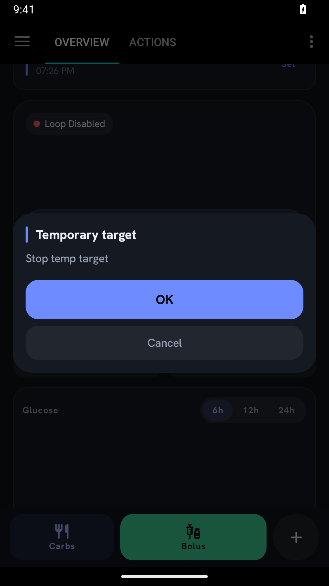
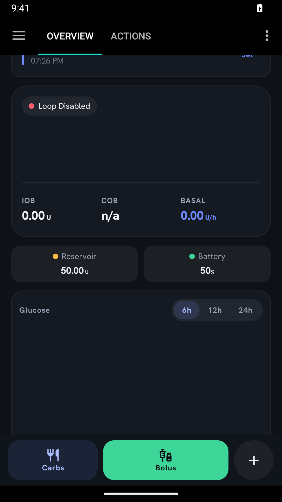
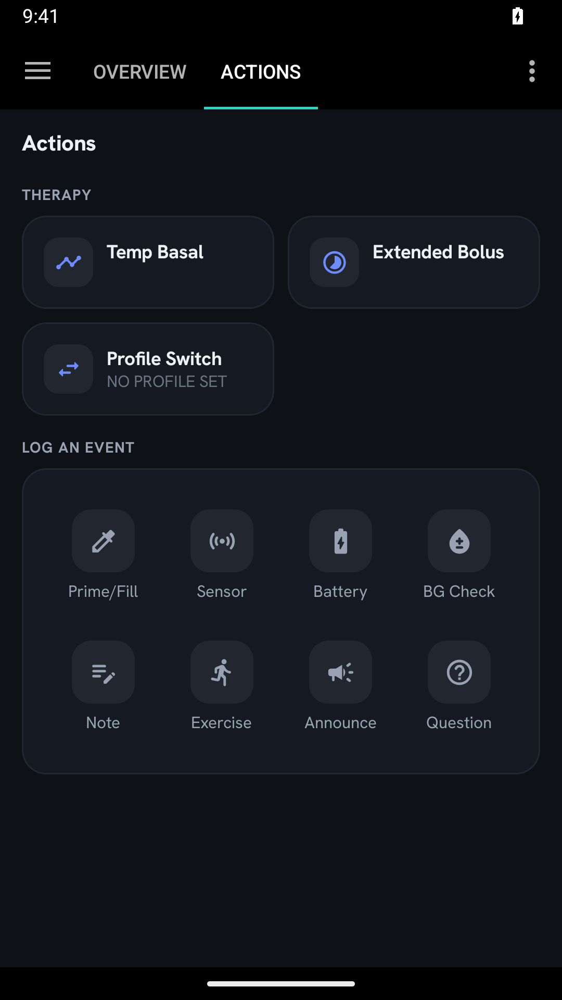

# PR #66 emulator evidence — September 28, 2026

Captured from the full `:app:assembleFullDebug` APK with the review fixes, running on the
isolated `AAPS_PR66_Review` Android 15 emulator. These are **actual app screenshots**, not
the earlier synthetic Compose preview harness. The pump is virtual, the loop is disabled,
and Nightscout sync is disabled. No physical pump or remote account was used.

The emulator has no active profile or glucose readings. This checks the requested missing-data /
stopped-loop visibility case, not target-relative glucose text or the historical graph. Those
calculations are covered by unit tests; the broader device checklist remains in
[temporary-target-display.md](../../temporary-target-display.md).

Steps performed:

1. Open Overview's `+` menu → Temp target → Activity (140 mg/dL, 90 minutes).
2. Start and confirm the target. Check the Overview ribbon and Actions card.
3. Return to Overview and tap the active target ribbon. Choose Cancel current temp target.
4. Confirm cancellation. Verify the ribbon clears and the Actions card disappears (expected
   with a stopped loop and no profile).

PIN/biometric protection was not configured in this emulator. The start/cancel confirmation
screens were exercised; this is not evidence of credential-protection testing or live expiry.

## Overview: active target, stopped loop

## Actions: active target without a profile

## Cancellation confirmation

## Overview after cancellation

## Actions after cancellation

