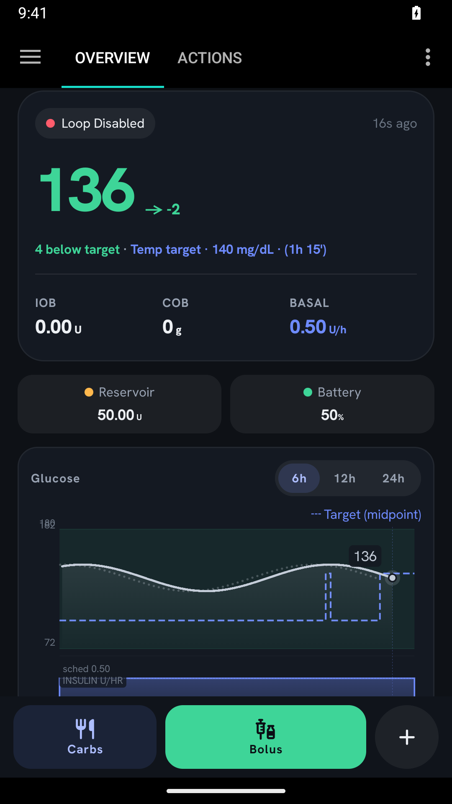
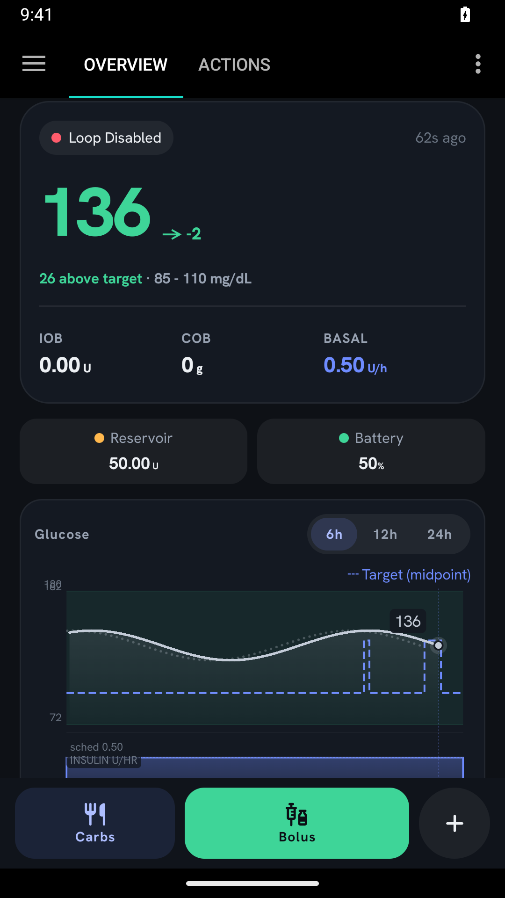

# PR #66 — compact inline target status

These screenshots supersede the earlier Overview banner screenshots in the parent directory.
Captured from the full debug app on the Android 15 `AAPS_PR66_Review` emulator.

## Setup and boundaries

- Synthetic persisted glucose of 136 mg/dL and a profile target of 85–110 mg/dL.
- Virtual pump only; loop and Nightscout sync disabled. No patient data or physical pump.
- A temporary, emulator-guarded fixture receiver inserted the test records. The standard debug
  APK was then reinstalled, removing the receiver before these screenshots were captured.
- Screenshots are unmodified device captures, not Compose previews or mockups.

## Verified

The Activity preset (140 mg/dL, 90 minutes) was started through the app's existing dialog and
confirmation flow. The comparison changed from **26 above target** to **4 below target**.
The final compact layout was then checked with the target still active. It puts the comparison,
`Temp target`, value and remaining time on the existing status line without a separate banner.

Tapping the active inline line opened the existing target dialog. Choosing **Cancel current temp target** and confirming **OK** refreshed the same line to **26 above target · 85 - 110 mg/dL**.

## Automated checks

- 20 focused tests passed: 8 `TargetChartDataTest`, 7 `TargetDisplayTest`,
  3 `TemporaryTargetExtensionKtTest`, and 2 `ActionsTargetStateTest`.
- `:app:assembleFullDebug` passed for the standard APK shown here.
- `git diff --check` passed.

Regression tests cover the 136 mg/dL example with profile, single temporary target, temporary
range, fallback, and mmol/L conversion. Expiry fallback is covered at the helper/unit-test level;
this device run verified cancellation, not waiting for expiry. Large-font, narrow-screen and
PIN-protection checks remain outside this recorded device run. Dosing logic and glucose warning
colours are unchanged.
