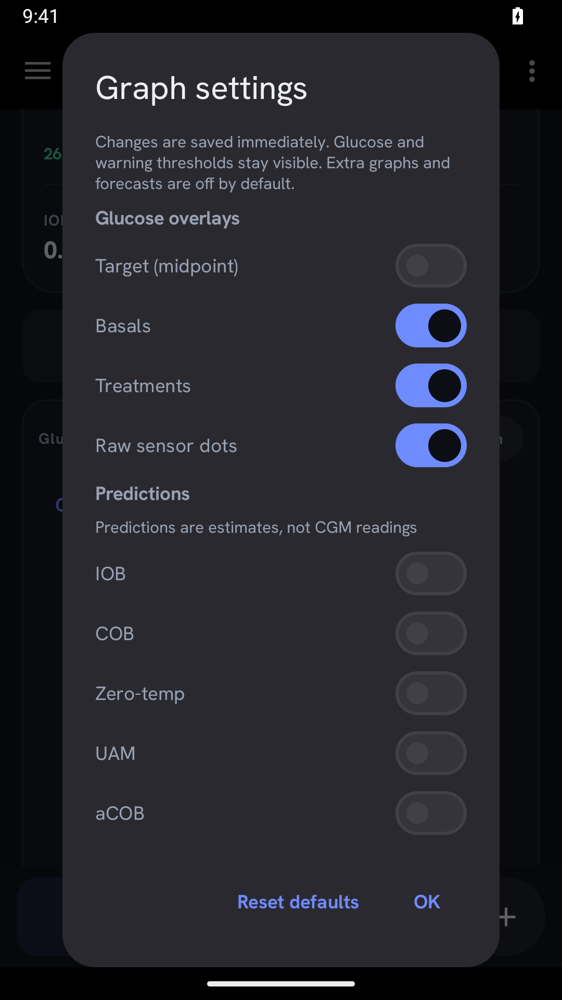
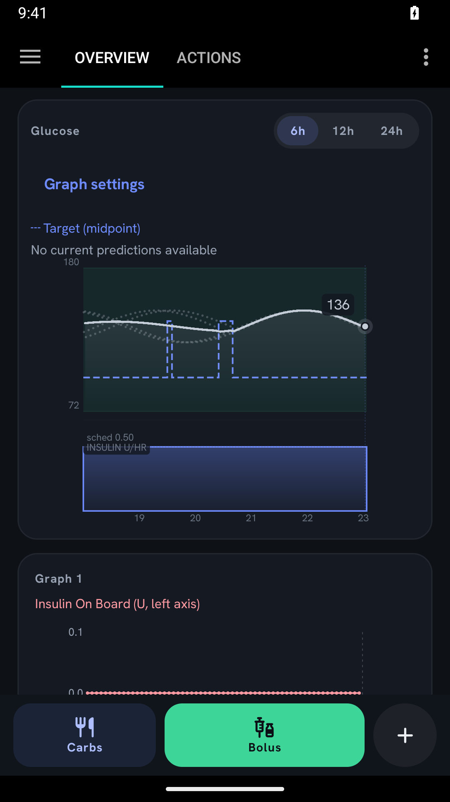
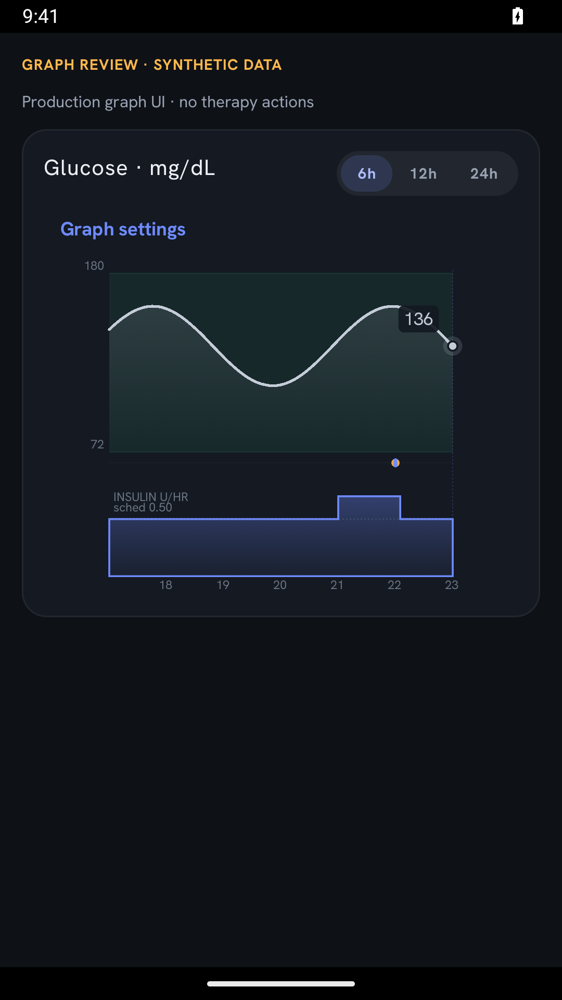
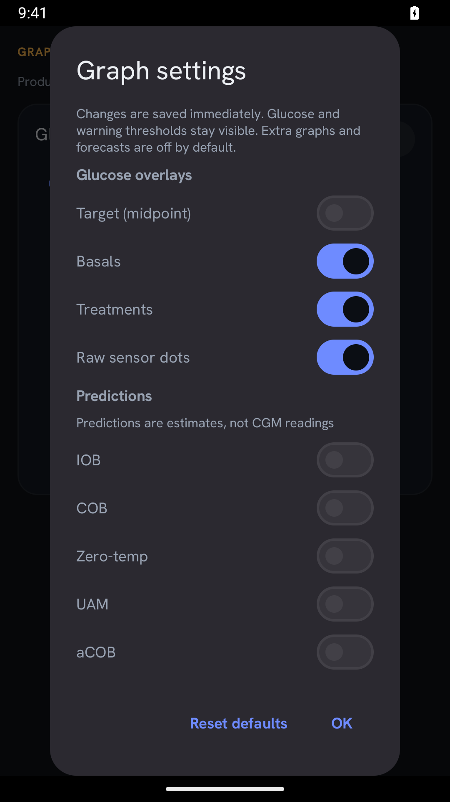
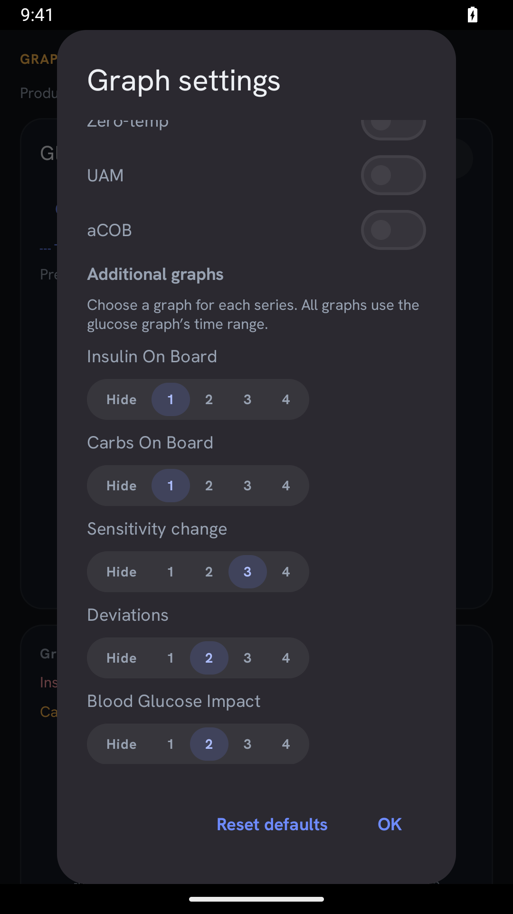
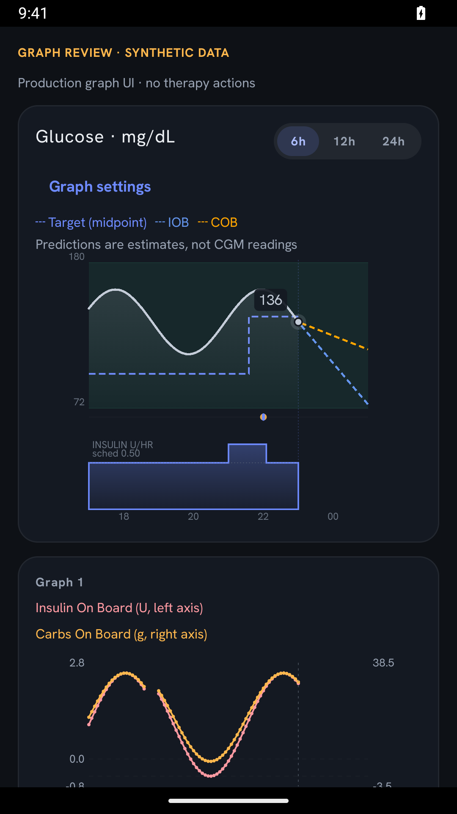
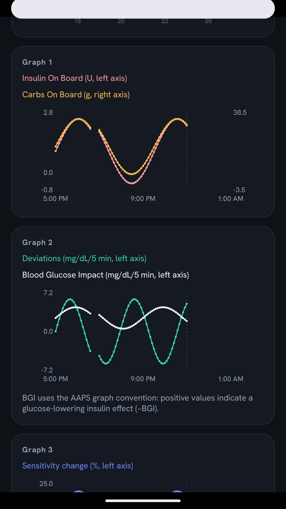
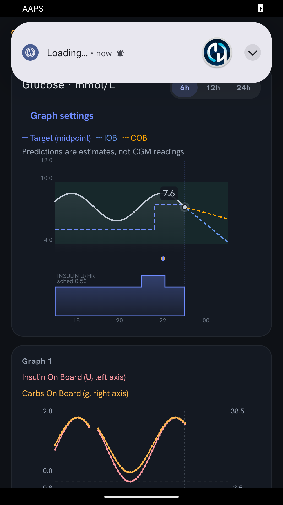
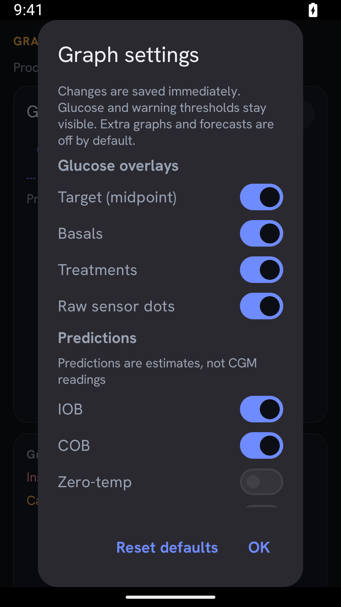
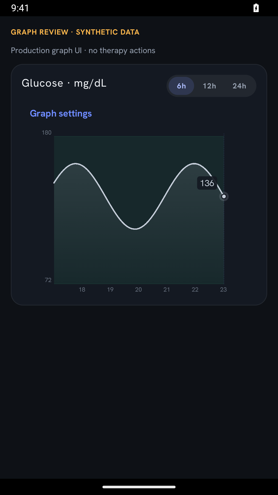

# PR #89 — configurable graph rework (draft)

## Stack and acceptance

`main` → **#66** (`fix/65-temp-target-visibility`) → **#89** (`graph-rework/configurable-overview`).

The upper PR targets #66's branch. It integrates #69 (predictions, `076c7a243f`) and #70
(additional graphs, `e8eb41c505`) as **unaccepted prototypes**, then adds shared graph settings and
integration fixes. Neither original PR has been closed, merged on GitHub, or edited. #89 remains
draft until the user accepts the combined UI. #66 alone retains its earlier always-visible target
graph: the mandatory graph optionality is in this upper layer, so evaluate the stack together.
After #66 merges, retarget #89 to main and reconcile the base (especially if #66 is squash-merged).
Do not independently merge the prototype PRs on top of the combined implementation.

## Controls and defaults

One **Graph settings** dialog is accessible from the glucose card, including when no additional
panels are visible. Changes save immediately; **Reset defaults** restores:

| Display element | Default | Control |
| --- | --- | --- |
| Glucose trace / warning thresholds | Visible | Always retained |
| Historical target midpoint | Off | On/off |
| Basal panel / treatment markers / raw sensor dots | On (existing display) | Independent on/off |
| IOB, COB, zero-temp, UAM, aCOB forecasts | Off | Each independently on/off |
| IOB, COB, sensitivity, deviations, BGI history | Hidden | Each: Hide or graph 1–4 |

Hiding basals/treatments gives their space back to glucose. Hiding a forecast also removes it from
the legend, vertical scaling and shared future time window. The graph target toggle does **not**
hide the active temporary-target status beneath the glucose reading or change therapy targets.

The shared display window extends only for selected, available forecasts. Target history, basal
history and additional series remain historical; their samples are not extrapolated. The combined
scale includes visible targets, measured/trace glucose and visible forecasts. All converted series
use the chart build's captured glucose units. Legends wrap outside the plotting canvas. Close axis
labels are suppressed rather than drawn on top of one another.

## Automated validation

Standard, non-fixture build:

```sh
./gradlew --no-daemon --max-workers=2 \
  -Dorg.gradle.jvmargs='-Xmx3g -XX:+UseParallelGC -Xss1024m' \
  :plugins:main:testFullDebugUnitTest \
  --tests '*Home*Graph*Test' --tests '*HomePredictionsTest' --tests '*Target*Test' \
  :app:assembleFullDebug
```

**37 tests, zero failures/errors:** 6 graph settings, 6 additional graph data, 5 predictions,
8 historical target chart, 7 target display, 3 target extensions, 2 Actions target state.
Includes defaults/serialization/invalid settings, independent forecast selection, shared viewport,
unchanged historical cutoff/data, visible-only bounds, negative values, gaps, units and stale or
missing predictions. `git diff --check` passed.

## Emulator verification — September 28, 2026

Android 15, isolated `AAPS_PR66_Review` emulator, no physical pump, virtual pump configured, loop
and Nightscout sync disabled. Captures below are unmodified device screenshots.

### Normal Overview, standard APK

Synthetic glucose/profile records were seeded into the emulator database using a local guarded
fixture receiver. The **standard APK was reinstalled to remove both the receiver and review
activity** before these captures. The normal Overview and real preference callbacks were tested:

- Open Graph settings, enable target midpoint and IOB predictions, assign IOB history to graph 1.
- Confirm target line appears and unavailable predictions show an explicit message rather than
  invented forecasts. The IOB history panel appears.
- Confirm both preferences are written; relaunch the process and confirm the same target,
  unavailable-prediction message and IOB panel return.





### Synthetic chart review activity — rendering and interaction only

A temporary local debug-only activity hosted the **production** `HomeGlucoseChart`,
`HomeAdditionalGraphs`, `HomeGraphSettingsControl`, settings codecs and `forDisplay` selector.
It supplied synthetic display snapshots directly, used separate review-only preferences and
exposed **no therapy actions**. The activity/fixture source is not part of the repository or standard
APK. These images are not evidence of end-to-end APS calculations or autosens data collection.

Exercised on-device: target and individual IOB/COB forecast toggles; IOB/COB assigned to graph 1,
deviations/BGI to graph 2, sensitivity to graph 3; persistence across activity/process restart;
reset-to-defaults; disabling basal/treatments/raw dots; mg/dL and mmol/L rendering; settings at
1.3× system font scale. Gaps and negative values are deliberately included in the synthetic data.

















## Still required before acceptance

- User visual acceptance of defaults, settings layout, colours, legend density and graph grouping.
- End-to-end device testing with real APS/IOB/COB/autosens results, including expiry/freshness,
  data arriving while toggles change, and missing history. Unit tests and synthetic screenshots
  are not a substitute for that integration run.
- Broader device/font/theme/locale checks; 12h/24h and all combinations of mixed-unit panels.
- Performance assessment on a representative device. Hidden additional series are currently
  still collected during chart refresh; visibility controls rendering, not background calculation.
- No dosing or physical-pump validation is claimed; no dosing, pump commands or persistence
  implementation was changed by the production graph rework.
