# PR #89 — configurable graph rework (draft)

## Stack and acceptance

`main` → **#66** (`fix/65-temp-target-visibility`) → **#89** (`graph-rework/configurable-overview`).

The upper PR targets #66's branch. It integrates #69 (predictions, `076c7a243f`) and #70
(additional graphs, `e8eb41c505`) as **unaccepted prototypes**, then adds shared graph settings and
integration fixes. Neither original PR has been closed, merged on GitHub, or edited. #89 remains
draft until the user accepts the combined UI. #66 alone retains its earlier always-visible target
graph: the mandatory graph optionality is in this upper layer, so evaluate the stack together.
After #66 merges, retarget #89 to main and reconcile the base (especially if #66 is squash-merged).
Do not independently merge the prototype PRs on top of the combined implementation.

## Review fixes — September 29, 2026

These captures supersede the stacked headings and mixed card boundaries in `preferences/`.

- Preference headings now label actual content cards, rather than every ancestor of a nested
  group. Returning from a child group ends its card. Additional graph pickers, the reset action,
  and Overview's Keep screen on switch no longer share a card. Simple nested screens retain
  their labels; hidden groups stay hidden. This fixes the renderer rather than reordering one
  offending setting. Storage and therapy preference handlers are unchanged.
- Target midpoint data extends through the four-hour future pan budget. The existing provider
  evaluates the known profile's time-of-day targets and temporary-target expiry, rather than
  indefinitely carrying the current temporary target forward. It is a planned reference, not
  a prediction of future profile edits. Missing profile information is not invented.
- The target dashed path now starts at the beginning of the bounded data snapshot and is clipped
  to the plot. Previously, slicing it at the viewport's moving predecessor reset dash phase.
  Emulator pan recording confirms the dash pattern moves instead of staying screen-anchored.
- `AutosensResult()` explicitly means unavailable and defaults to ratio 1. Sensitivity plugins
  return it when computation inputs are missing. The old mapper graphed that fallback as 0%,
  indistinguishable from a computed neutral ratio. The display now omits unavailable results,
  retains computed ratio 1, and preserves the existing gap threshold. No smoothing, carry-forward,
  worker, sensitivity algorithm, dosing, or pump changes.

### Sensitivity evidence and limits

A local synthetic replay feeds the production mapper one-minute samples with a computed result
at five-minute intervals and unavailable defaults between them. The old mapping reproduces the
sawtooth; the corrected mapping removes those artificial zeroes. A deliberate 20-minute missing
interval remains a gap, and a final computed ratio of 1 remains a real 0% line. This demonstrates
an actual display bug and a plausible explanation of the user's screenshot, **not proof that all
spikes in their real history are unavailable defaults**. Their underlying autosens records/logs
are still needed to establish that. Genuine rapid changes are intentionally not removed.

### Verification

- 78 focused JVM tests passed (74 plugins/main + 4 app), including regressions for preference
  ancestry/sibling boundaries, hidden groups, neutral vs unavailable sensitivity, and future
  profile schedule/temporary-target expiry. Standard `assembleFullDebug` passed.
- Android 15 `AAPS_PR66_Review`: checked headings and separate cards, Reset defaults immediately
  updating picker summaries, native panel pickers, overlay/forecast toggles and serialized storage.
  Re-enabled target + IOB prediction, IOB panel 1 and sensitivity panel 3 after resetting.
- Production chart composables exercised in an uncommitted, emulator-only fixture activity:
  synthetic before/after sensitivity, future target return to profile, synchronized horizontal pan.
  The chart captures below are **synthetic**, not the user's history or an end-to-end APS run.
- Rebuilt and reinstalled the standard APK after fixture verification. Manifest checked with aapt:
  no GraphReviewActivity or SeedReceiver. Emulator notification-heads-up setting restored.

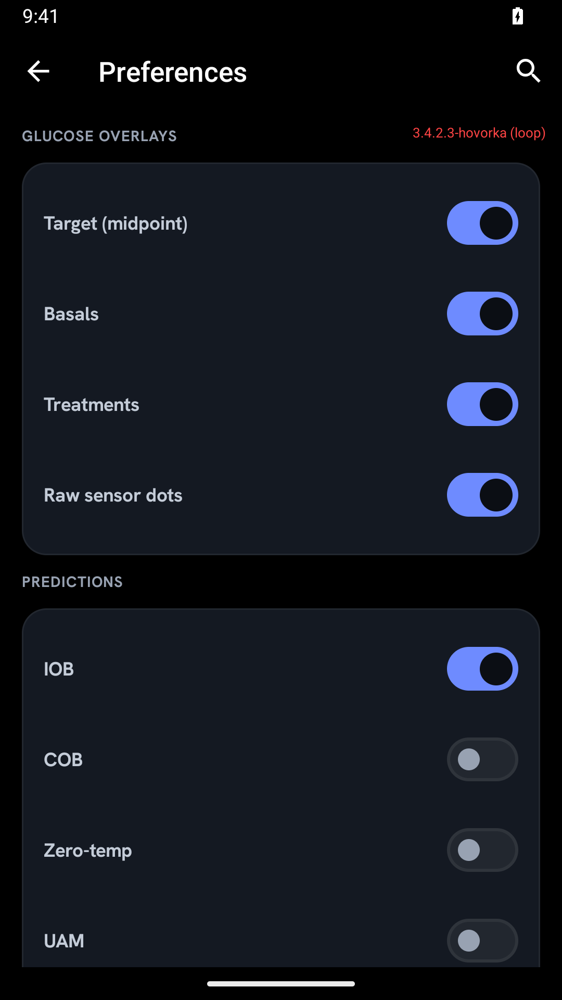

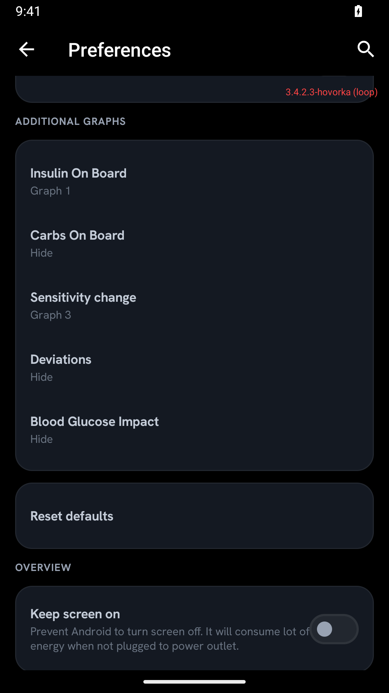

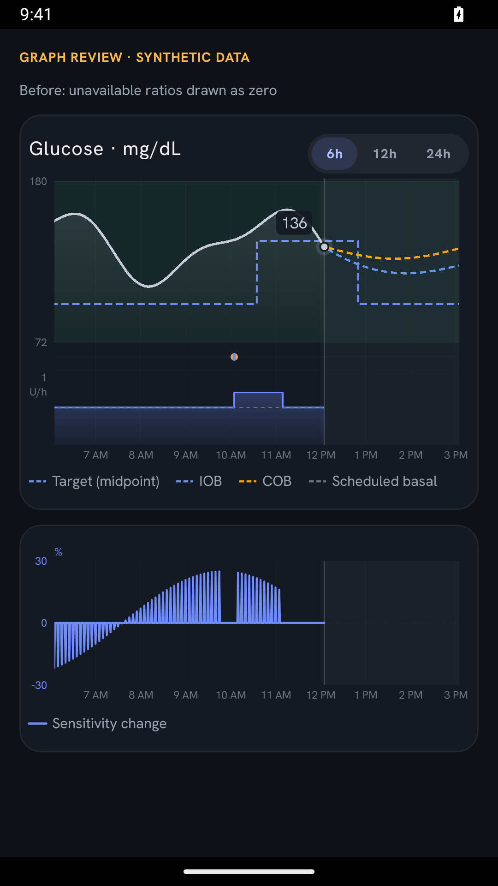

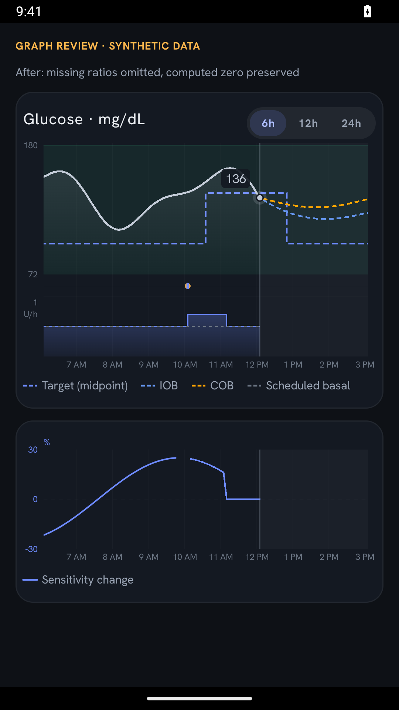

[Horizontal pan recording](refinements/06-target-pan.mp4) ·
[Panned screenshot](refinements/05-target-panned.png)

## Graph controls in Preferences — current placement

Graph configuration now lives in the existing **Overview Preferences → Graph settings** preference
tree (also included in general Preferences). Open it through the existing overflow menu; there is
no new settings button or gear on the glucose card. The card retains its 6/12/24 h selector.

The native preference tree contains overlay/forecast switches, additional-series panel pickers
(Hide / Graph 1–4), and Reset defaults. It uses the same two serialized storage keys as before,
so existing choices and defaults survive the move. Overview reloads them on resume, not only
when its view is recreated. The old graph-settings Compose dialog is removed.

The preference renderer now handles non-typed native switches and snapshots mutable summaries/
checked states; this lets picker results and reset defaults update immediately without closing
Preferences. Existing typed preference handlers and their validation remain unchanged.

Verified on the isolated Android 15 emulator using the standard APK:
- Enter Overview Preferences through the overflow menu.
- Enable target/IOB forecasts; assign IOB history to Graph 1; verify saved codec values.
- Verify the native picker and updated Graph 1 summary; reset and verify both stored defaults
  and the visible Hide summary, then select Graph 1 again.
- Return to the existing Overview, confirm changes apply and no Graph settings row remains.
- Reopen Preferences and confirm saved choices. No therapy actions were invoked.

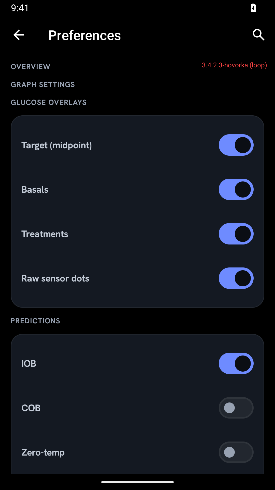

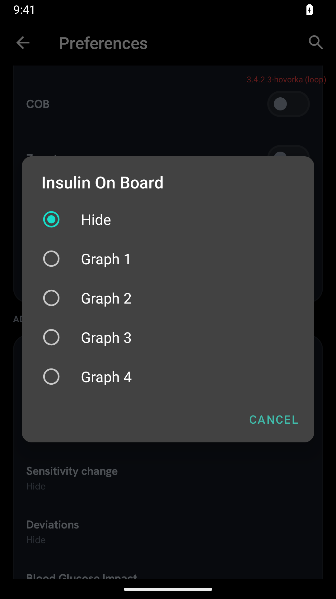

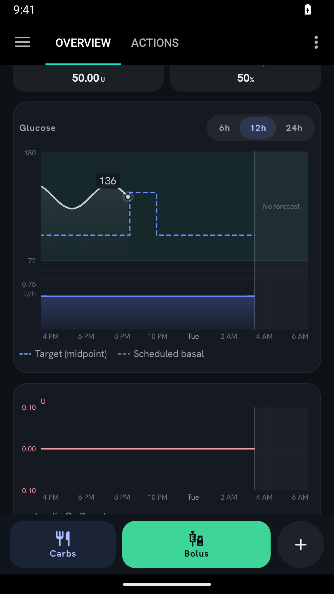

The screenshots use the standard app with earlier synthetic database records. Those glucose
records are now stale, so the line stops at its actual last timestamp; the blank history is not
caused by moving settings. No fixture activity or receiver is present in this APK.

## Compact horizontal layout — current screenshots

The `compact/` captures supersede the earlier horizontal spacing. The previous layout stacked
16 dp of card padding with a fixed 40 dp plot gutter on **each** side. The new layout uses
8 dp horizontal card padding and measures the actual enabled axis labels, respecting units,
locale and font scale. A right axis only takes space when an enabled panel needs one; otherwise
that edge reserves 8 dp for the endpoint halo. All panels receive the same measured insets,
including the horizontal gesture's pixel-to-time conversion.

In the 1080 px multi-panel fixture, plot width increased from approximately 702 px to 857 px
(**22% more plotting width**) without shrinking the labels. Tested mg/dL and mmol/L, two-axis
panels, 1.3× font scale, panning/vertical scrolling, and the standard APK's normal Overview with
no right-hand axis. Final standard APK contains no fixture components; font scale restored to 1.0.

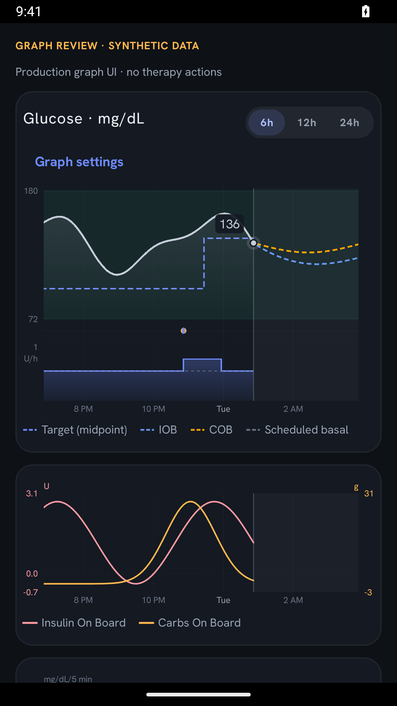

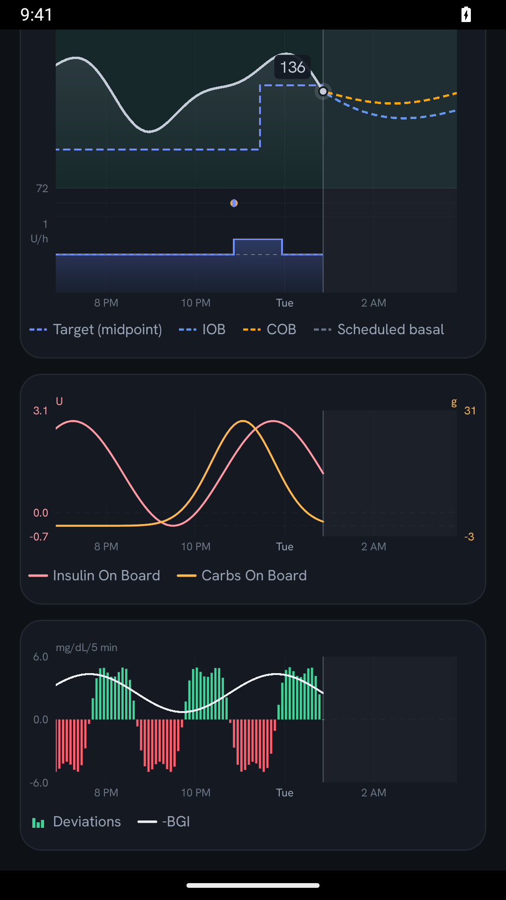

Additional checks: [large font](compact/03-large-font.png),
[mmol/L and large font](compact/04-mmol-large-font.png),
[normal Overview, standard APK with synthetic database history](compact/05-overview-standard.png).

## Rolling/panning refinement — current review

The `rolling/` captures below supersede the original screenshots farther down this document.
Implementation was delegated to Claude with the requested `claude-opus-5.5` model identifier;
the parent reviewed the diff, fixed integration issues, and ran the builds/emulator checks.

- **6/12/24 h means history.** Any forecast enabled adds a fixed **3 h** future area, whether
  predictions are available or not. Forecast lengths/expiry never change the horizontal scale.
- **Horizontal drag/fling** shares one timestamp across every panel, with a small **Now** control.
  History is loaded for the last 24 h on the existing background refresh, not on each gesture.
  The 24 h selection already shows all loaded history; use History for older records.
  Forecast mode allows peeking up to 4 h ahead; with forecasts off the right bound is now.
- A panned window stays on its absolute time across refreshes, except when the oldest loaded boundary
  catches up. Range changes, forecast mode changes, returning to Home, or **Now** resume live-follow.
- Actual-now line and latest-reading marker are independent. Historical series stop at now.
  The trace combines available bucketed coverage with raw readings at either edge; sensor gaps
  remain gaps. Basal uses a fixed 3-minute grid and the historical scheduled profile.
- Compact **bottom legends**, coloured unit axes, shared phone-format clock ticks, and deviations
  as positive/negative bars with optional −BGI. BGI/sensitivity conventions remain available to
  accessibility without permanent explanatory paragraphs.
- Parent integration fixes: clear obsolete pan state on window changes; equal card insets for exact
  plot alignment; reserve chart touch streams from the host ViewPager2 so panning does not switch
  tabs. Compose vertical page scrolling remains available.

### Current evidence

Android 15, isolated `AAPS_PR66_Review`, virtual pump, loop and remote sync disabled. Display
fixtures are synthetic, not clinical or end-to-end APS validation. The temporary review activity
and seeder are not committed and are absent from the final standard APK.

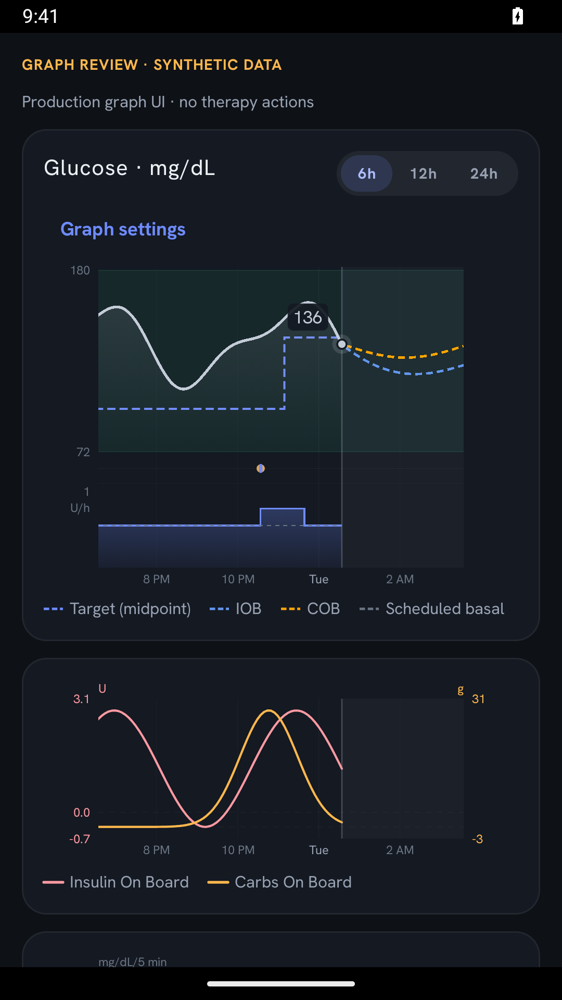

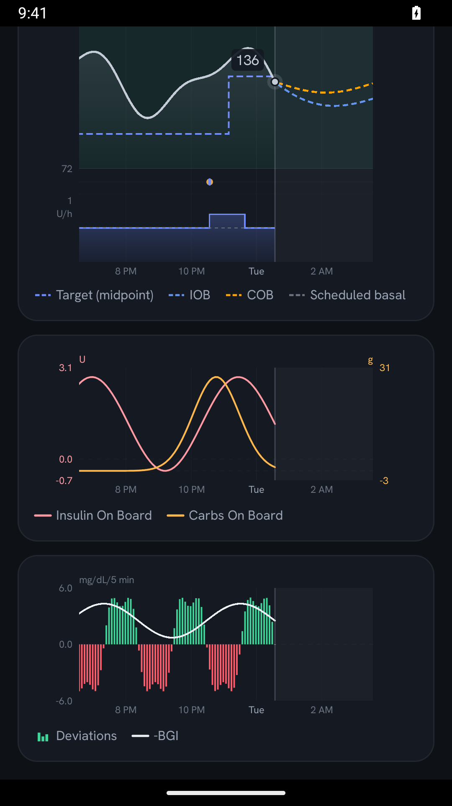

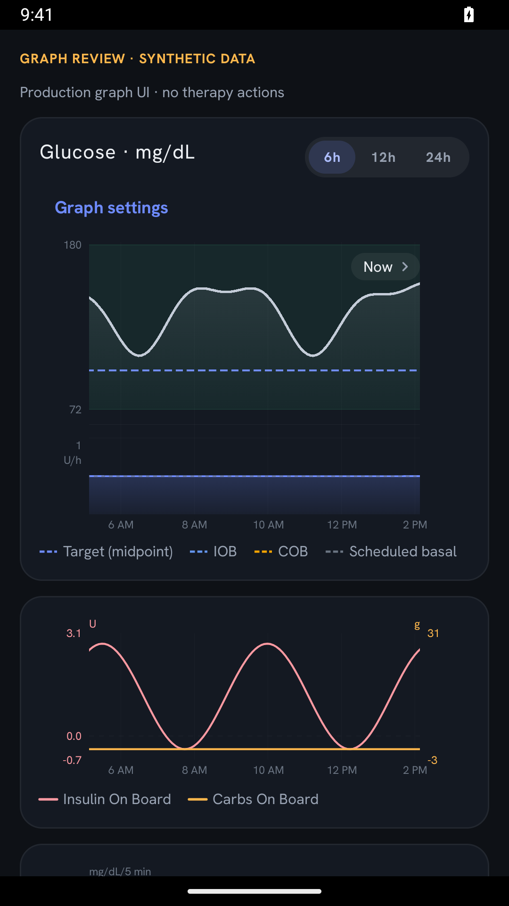

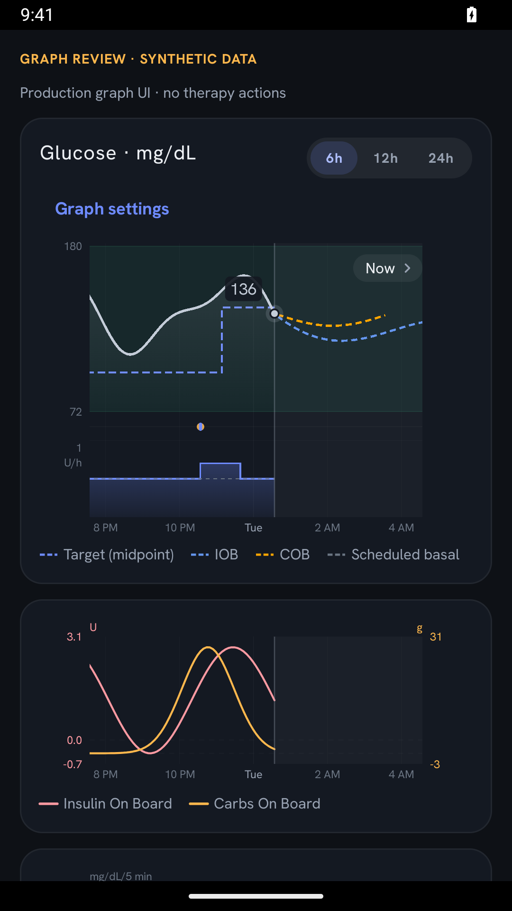

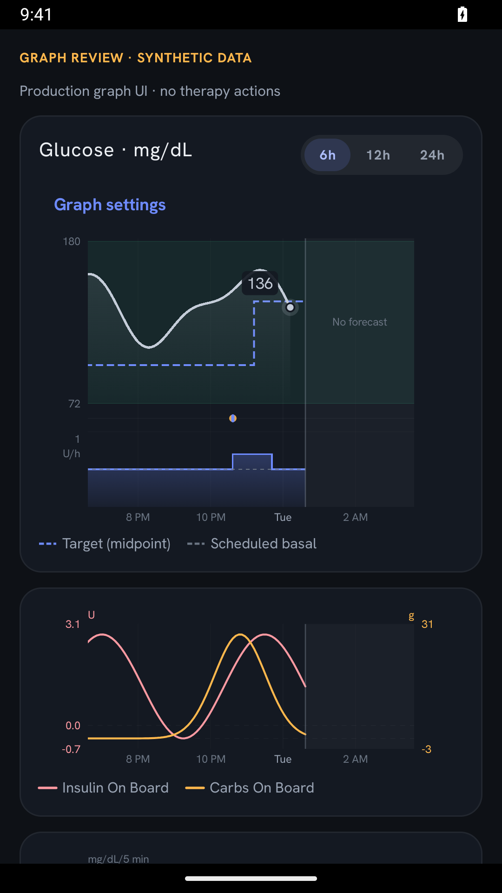

Additional captures: [settings](rolling/01-settings.png), [12 h](rolling/06-12h.png),
[24 h](rolling/07-24h.png), [mmol/L](rolling/09-mmol.png),
[normal Overview](rolling/10-overview-standard.png),
[normal Overview panned](rolling/11-overview-pan.png).

## Controls and defaults

The **Graph settings** section is in **Overview Preferences**, including when no additional
panels are visible. Changes save immediately; **Reset defaults** restores:

| Display element | Default | Control |
| --- | --- | --- |
| Glucose trace / warning thresholds | Visible | Always retained |
| Historical target midpoint | Off | On/off |
| Basal panel / treatment markers / raw sensor dots | On (existing display) | Independent on/off |
| IOB, COB, zero-temp, UAM, aCOB forecasts | Off | Each independently on/off |
| IOB, COB, sensitivity, deviations, BGI history | Hidden | Each: Hide or graph 1–4 |

Hiding basals/treatments gives their space back to glucose. Hiding a forecast removes it from
the legend and vertical scaling; only turning off all forecasts removes the fixed future area. The graph target toggle does **not**
hide the active temporary-target status beneath the glucose reading or change therapy targets.

The shared display window reserves three future hours whenever any forecast is enabled. Target history, basal
history and additional series remain historical; their samples are not extrapolated. The combined
scale includes visible targets, measured/trace glucose and visible forecasts. All converted series
use the chart build's captured glucose units. Legends wrap outside the plotting canvas. Close axis
labels are suppressed rather than drawn on top of one another.

## Automated validation

Standard, non-fixture build:

```sh
./gradlew --no-daemon --max-workers=2 \
  -Dorg.gradle.jvmargs='-Xmx3g -XX:+UseParallelGC -Xss1024m' \
  :plugins:main:testFullDebugUnitTest \
  --tests '*Home*Test' --tests '*Target*Test' --tests '*OverviewPluginTest' \
  :app:testFullDebugUnitTest --tests '*PreferenceScreenComposeTest' \
  :app:assembleFullDebug
```

**74 tests, zero failures/errors:** 18 viewport/pan/clock tests, 10 chart-data/layout tests,
8 graph settings, 6 additional graph data, 5 predictions, 8 historical target chart,
7 target display, 3 target extensions, 2 Actions target state, 5 Overview preference-tree tests
and 2 app preference-renderer snapshot tests. Standard full-debug build and
`git diff --check` passed. Viewport tests include forecast-independent widths, bounds,
paused refreshes, live reset, midnight, 12/24 h and spring/fall DST transitions.

Current emulator checks: selected forecast toggles/assignments; shared past/future pan and Now;
vertical scrolling starting on a graph; 6/12/24 h; mmol/L; stale marker/no forecasts;
normal Overview database-backed history and pan in the standard APK, including both swipe
directions without changing tabs, paused state surviving a refresh, and 6→12→6 range changes
returning to live rather than reviving the old pan. Synthetic glucose/profile
records remain in the isolated emulator database. Real APS/autosens transitions and physical-device
performance still require acceptance testing.

## Earlier baseline verification — September 28, 2026 (superseded visuals)

Android 15, isolated `AAPS_PR66_Review` emulator, no physical pump, virtual pump configured, loop
and Nightscout sync disabled. Captures below are unmodified device screenshots.

### Normal Overview, standard APK

Synthetic glucose/profile records were seeded into the emulator database using a local guarded
fixture receiver. The **standard APK was reinstalled to remove both the receiver and review
activity** before these captures. The normal Overview and real preference callbacks were tested:

- Open Graph settings, enable target midpoint and IOB predictions, assign IOB history to graph 1.
- Confirm target line appears and unavailable predictions show an explicit message rather than
  invented forecasts. The IOB history panel appears.
- Confirm both preferences are written; relaunch the process and confirm the same target,
  unavailable-prediction message and IOB panel return.


### Synthetic chart review activity — rendering and interaction only

A temporary local debug-only activity hosted the **production** `HomeGlucoseChart`,
`HomeAdditionalGraphs`, `HomeGraphSettingsControl`, settings codecs and `forDisplay` selector.
It supplied synthetic display snapshots directly, used separate review-only preferences and
exposed **no therapy actions**. The activity/fixture source is not part of the repository or standard
APK. These images are not evidence of end-to-end APS calculations or autosens data collection.

Exercised on-device: target and individual IOB/COB forecast toggles; IOB/COB assigned to graph 1,
deviations/BGI to graph 2, sensitivity to graph 3; persistence across activity/process restart;
reset-to-defaults; disabling basal/treatments/raw dots; mg/dL and mmol/L rendering; settings at
1.3× system font scale. Gaps and negative values are deliberately included in the synthetic data.


## Still required before acceptance

- User visual acceptance of defaults, settings layout, colours, legend density and graph grouping.
- End-to-end device testing with real APS/IOB/COB/autosens results, including expiry/freshness,
  data arriving while toggles change, and missing history. Unit tests and synthetic screenshots
  are not a substitute for that integration run.
- Broader device/font/theme/locale checks; 12h/24h and all combinations of mixed-unit panels.
- Performance assessment on a representative device. Hidden additional series are currently
  still collected during chart refresh; visibility controls rendering, not background calculation.
- No dosing or physical-pump validation is claimed; no dosing, pump commands or persistence
  implementation was changed by the production graph rework.
